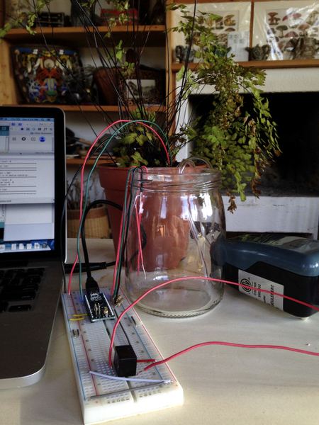
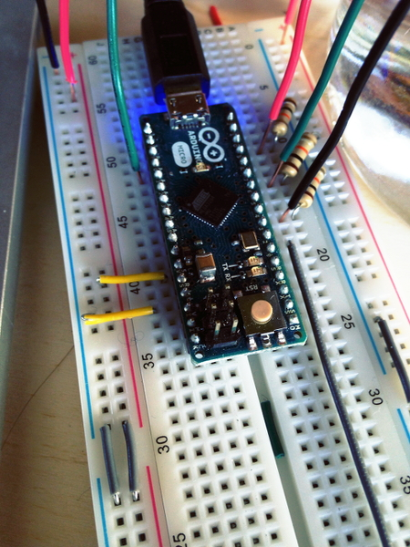

# self-watering-plant
A prototype of a self-watering plant system. Water pump communicates with soil moisture sensor, to determine the appropriate times to water the plant. Additionally, a simple water level sensor determines whether water reserves are high, medium or low. 

# Goals
Render plants more autonomous. Rather than remembering to water plants everyday, owners can let the plant water itself when it needs it - receiving text reminders when they need to refill the plant's water reservoir (at a much lower frequency than daily watering).

# Parts list
1. One arduino compatible capacitive moisture sensor (http://www.amazon.com/gp/product/B00AFCNR3U?ref_=pe_1196280_123950170)
2. One arduino micro (http://arduino.cc/en/Main/arduinoBoardMicro)
3. One 5V/DC Single Pole Double Throw (SPDT) micro relay (http://www.radioshack.com/5vdc-1a-spdt-micro-relay/2750240.html#.VQNfXWTF-5I)
4. Three 10 kOhms resistors (http://www.amazon.com/gp/product/B0002HBQHW/ref=od_aui_detailpages00?ie=UTF8&psc=1) 
5. One breadboard (http://www.adafruit.com/product/64)
6. Two wire nuts (http://www.radioshack.com/assorted-screw-on-wire-connectors-16-pack/6403057.html)
7. One submersible aquarium pump (http://www.amazon.com/gp/product/B001BOD9JI/ref=od_aui_detailpages01?ie=UTF8&psc=1)
8. 1/4" flexible airline tubing (http://www.amazon.com/gp/product/B0002563MM/ref=od_aui_detailpages00?ie=UTF8&psc=1)
9. Jumper wires (http://www.radioshack.com/solderless-breadboard-jumper-wire-kit/2760173.html#start=1)
10. Hookup wire (http://www.radioshack.com/75-ft-ul-recognized-hookup-wire-22awg/2781224.html#.VQNhzWTF-5I)

# Current phase
Prototype. Pump successfully responsive to low soil moistures. Water levels accurately detected. Design still bulky.

# Future goals 
- Miniaturize the system, and develop aesthetic casing.
  - Develop casing to contain water reservoirs and pump. 
  - Develop or obtain smaller pump, include method to route wires from sensor: bottom of the pot?	
- Connect to wireless (GSM/wifi) and develop partner app
  - Build texting capabilities to alert owner when water reserves are low
  - Keep track of missed and successful waterings (due to successful or unsuccessful fillings of the reserve by owner). 

# Photos

Moisture sensor

Water-level sensor. Bottom wire is at 5V. Arduino reads inputs from other 3 wires to determine which are electrically connected to the 5V wire.

Water level wires, with pull down resistors.

Tubing to pump water

